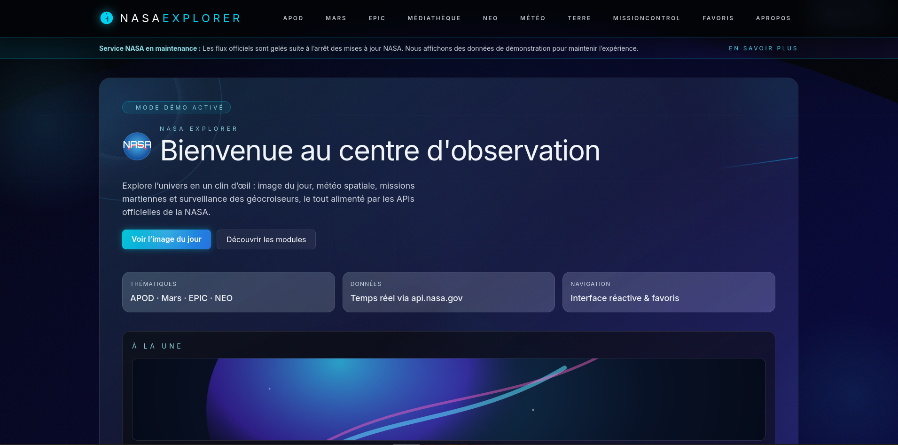
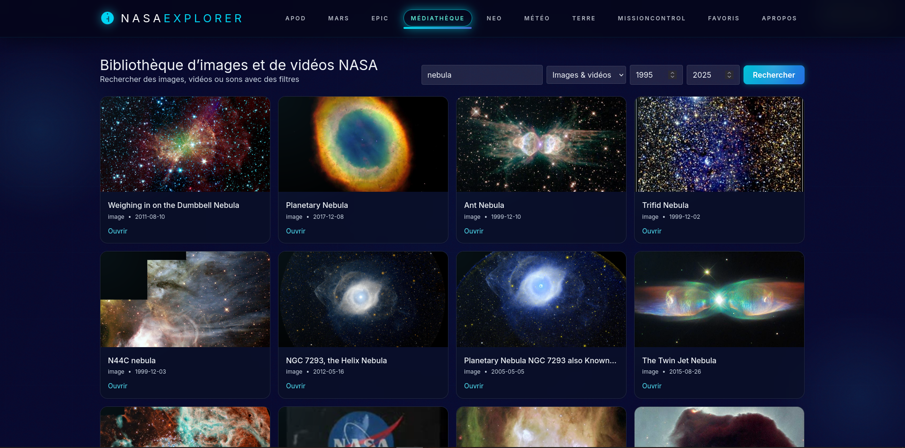
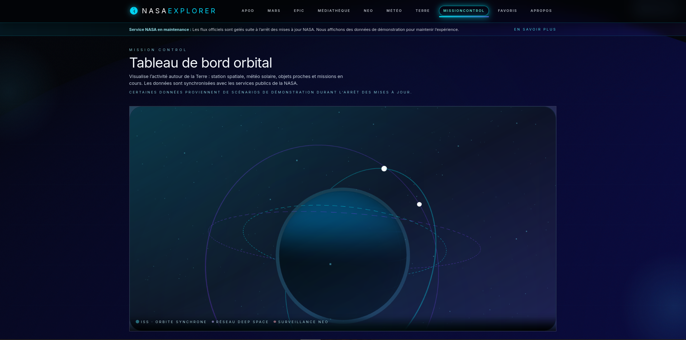
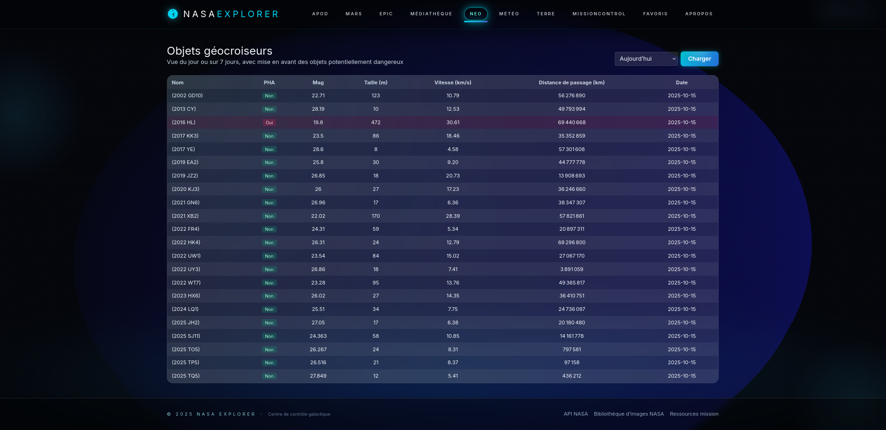

# 🚀 NASA Explorer — Side Project Frameworks & Données

> Application immersive réalisée dans le cadre du **side project hebdomadaire** : 1 h par séance consacrée à l’exploration d’un framework et d’une API de données. Nous avons choisi de pousser l’expérience dans l’espace avec les jeux de données publics de la NASA.

---

## 1. Contexte pédagogique

| Élément | Détail |
|---------|--------|
| Objectif | Découvrir / approfondir un **framework d’interface web** en binôme, via une application d’exploration de données. |
| Cadre | 1 h dédiée **en fin de séance** tout au long de la période (date de rendu : **avant le 30 octobre**). |
| Frameworks suggérés | **CSS** : UIkit, PureCSS, Bulma, Skeleton, Milligram, Tailwind CSS.<br>**Web** : Svelte, Vue.<br>**Desktop** : NeutralinoJS, ElectronJS. |
| API suggérées | NBA, NHTSA, Bandsintown, Open Movie DB. Nous avons volontairement exploré un autre référentiel public (NASA) pour varier les notions de résilience et d’expérience immersive. |
| Livrables | Archive `.zip` avec code source, **README** complet, **quickstart.pdf** (mini tutoriel du framework utilisé). |
| Évaluation | 12 pts : qualité du code & richesse techno. 8 pts : qualité de la documentation (clarté, illustrations, vocabulaire). |

### Pourquoi la NASA ?
Le shutdown fédéral d’octobre 2025 perturbe plusieurs API officielles. Ce contexte permet :
- d’expérimenter des **fallbacks automatiques**,
- de concevoir une **UX transparente** malgré l’indisponibilité des données,
- de documenter un cas réel de migration d’API (Earth → GIBS WMTS).

---

## 2. Frameworks et ressources mobilisés

| Catégorie | Choix retenu | Pourquoi |
|-----------|--------------|----------|
| Framework web | **Vue 3** (Composition API) | Composants réactifs, transitions natives (`<transition>`), intégration Pinia. |
| Framework CSS | **Tailwind CSS** | Tokens utilitaires, design “glass & neon”, réactivité mobile rapide. |
| Visualisation 3D | **Three.js** | Scène orbitale en temps réel pour MissionControl. |
| Gestion d’état | **Pinia** | Stores `status` (mode démo) & `observatory` (widgets). |
| HTTP | **Axios + client custom** | Retries, timeout, fallback, logging normalisé. |
| Illustrations | SVG génératifs | Placeholders APOD / Mars / Earth en mode simulation. |

> À noter : le README inclut également les guides d’introduction officiels à **Vue** et **Svelte**, conformément à la note de cadrage (cf. §10).

---

## 3. Aperçu visuel

| Home hero | Mission Control | Mobile nav | Galerie APOD |
|-----------|----------------|------------|--------------|
|  |  |  |  |

Highlights UI :
- nav néon avec underline dynamique, mode mobile (bouton “MENU”), badges démo,
- hero holographique (anneau spectral rotatif, comète animée, grille conique),
- MissionControl : globe 3D responsive + halo volumétrique + orbites animées,
- placeholders illustrés pour les fallback (APOD, Mars, Earth).

---

## 4. Fonctionnalités principales

1. **Dashboard d’accueil** : APOD du jour, panels rovers/EPIC/NEO, hero animé.
2. **MissionControl** : scène 3D Three.js, état des systèmes (NEO, EPIC, rovers, météo solaire), toggle audio synthétique.
3. **APOD Gallery** : navigation par plage de dates, modale HD, favoris, gestion fallback cache/simulation.
4. **Mars Rover Explorer** : filtres (rover, sol, date, caméra), pagination, fallback multi-rovers.
5. **EPIC Earth** : dates `natural/enhanced`, aperçu, lien vers archives, migration GIBS.
6. **NASA Library Search** : recherche plein texte, filtres media type, année, pagination.
7. **NEO Radar** : synthèse `/feed/today` + sparkline 7 jours.
8. **Space Weather (DONKI)** : timeline par type (CME, FLR, GST) avec badges instruments.
9. **Favorites** : stockage local, export/import JSON.
10. **Responsive design** : nav mobile dédiée, layout fluide (0 ≤ width ≤ desktop).

Chaque page consultable sur mobile via le bouton d’action “MENU” (affiche un panneau en plein écran). Les contenus exploitent des grilles Tailwind responsive (`grid-cols-1`, `lg:grid-cols-*`).

---

## 5. Données & API NASA

Malgré la recommandation initiale (NBA, NHTSA, Bandsintown, OMDb), nous avons exploré l’écosystème NASA :

| Domaine | Endpoint principal | Notes shutdown |
|---------|--------------------|----------------|
| APOD | `/planetary/apod` | Retry + fallback cache/simulation. |
| Mars | `/mars-photos/api/v1/rovers` + `/photos` | Descente date + images démo. |
| EPIC | `/EPIC/api/{mode}` | Cache des dates, fallback dataset. |
| NEO | `/neo/rest/v1/feed` | Reconstruction synthétique 7 jours. |
| DONKI | `/DONKI/{type}` | Événements simulés si indispo. |
| Library | `https://images-api.nasa.gov/search` | Gestion d’erreurs gracieuse. |
| Earth imagery | **GIBS WMTS** | `https://gibs-{a-c}.earthdata.nasa.gov/...`.

> Message officiel NASA (oct. 2025) : « *Due to the lapse in federal government funding, NASA is not updating this website...* ». Le store `status` active un mode démo (bandeau + badges) à la moindre erreur réseau.

---

## 6. Installation & lancement

### Pré-requis
- Node.js ≥ 18
- npm (ou pnpm/yarn)

### Étapes
```bash
npm install
cp .env.example .env.local     # renseigner la clé NASA + options GIBS
npm run dev                    # http://localhost:5173
```

Grâce aux fallbacks, l’application reste consultable même sans clé (`VITE_DEMO_MODE=true`).

### Build & preview
```bash
npm run build
npm run preview
```

---

## 7. Configuration (.env)

```env
VITE_NASA_API_KEY=YOUR_KEY
VITE_NASA_API_BASE=https://api.nasa.gov
VITE_NASA_IMAGES_BASE=https://images-api.nasa.gov
VITE_GIBS_LAYER=VIIRS_SNPP_CorrectedReflectance_TrueColor
VITE_GIBS_DATE=default
VITE_GIBS_TILEMATRIXSET=GoogleMapsCompatible_Level9
VITE_DEMO_MODE=false
```

*Astuce :* passer `VITE_DEMO_MODE=true` pour tester la navigation hors-ligne.

---

## 8. Architecture & technique

```
src/
├─ api/                # axios + retries + fallbacks (withCache, status store)
├─ assets/placeholders # SVG simulation (APOD/Mars/Earth)
├─ components/
│  ├─ mission/         # MissionControlScene (Three.js + shaders)
│  ├─ home/            # GuidedTour, ObservatoryConfigurator
│  └─ ui/              # buttons, loaders, modal, error states
├─ layouts/            # MainLayout (bandeau offline + audio toggle)
├─ pages/              # Vue pages (Home, Apod, Mars, Epic, Neo, SpaceWeather, Earth, Favorites)
├─ stores/             # Pinia (favorites, status, observatory)
└─ style.css           # tokens globaux, animations, HUD neon
```

- **AudioControl** : oscillateurs Web Audio (drone triangle + souffle cabine + bip télémétrie).
- **Responsive nav** : bouton “MENU” 👉 panneau plein écran, liens stylés (`nav-link-mobile`).
- **Three.js** : shaders custom (océan / city lights), orbites animées, trail dashed, parallax pointer.
- **Animations** : `grid-shift`, `orb-drift`, `comet-streak`, `warp` transitions.

---

## 9. Résilience & QA checklist

| Domaine | Tests recommandés |
|---------|-------------------|
| Offline | DevTools « offline » → bandeau maintenance, images fallback. |
| APOD | API key valide vs invalide → check badge `Simulation`. |
| Mars | Date sans résultat → descente sol/date, placeholders. |
| MissionControl | Responsive (< 768px) → bouton menu + caméra dézoomée. |
| Audio | Toggle ON/OFF → drone + bip, arrêt propre. |
| Build | `npm run build` → lint CSS/JS via Vite. |

Potential e2e (Playwright) : mobile navigation, favorites CRUD.

---

## 10. Livrables & documentation

- ✅ **README (ce fichier)** : installation, usage, captures, techniques.
- 🔜 **quickstart.pdf** : mini tutoriel « créer votre première page avec Vue 3 + Tailwind » (à livrer avec l’archive).
- ✅ **Archive .zip** : inclure code complet, assets, README, quickstart.

Guides de démarrage utiles :
- [Guide d’introduction de Vue](https://vuejs.org/guide/introduction.html)
- [Vue SFC Playground](https://sfc.vuejs.org/)
- [Guide aperçu de Svelte](https://svelte.dev/docs)
- [Tutoriel « Votre première appli Svelte » (Alsacréations)](https://www.alsacreations.com/tuto/lire/1802-svelte-introduction-et-premiers-pas.html)

---

## 11. Évaluation (rappel)

| Critère | Pondération | Comment nous y répondons |
|---------|-------------|---------------------------|
| Richesse & qualité du code | **/12** | Vue 3 + Pinia + Tailwind + Three.js, naming cohérent, commentaires ciblés, réactivité mobile. |
| Documentation | **/8** | README illustré, sections claires, notation pédagogique, instructions précises. |
| Total projet side | **20%** de la note finale | Reste : mini-projet final (30%) + DS 1h (50%) + bonus QCM (≤ +4 pts). |

---

## 12. Roadmap & extensions possibles

- [ ] Intégration MapLibre pour visualiser en direct les tuiles GIBS.
- [ ] Mode PhotoFrame pour kiosques (boucle MissionControl + audio ambiant).
- [ ] Tests Playwright (`status` store, nav mobile).
- [ ] Ajout d’un module “Guided tour” scripté (voix off + highlights).

---

## 13. Remerciements & licence

- Données : NASA & partenaires (domaine public, respect des guidelines NASA usage).
- Inspirations UI : HUD de centre de contrôle spatial, interfaces holographiques.
- Licence : **MIT**.

Bon voyage parmi les étoiles 🌌
